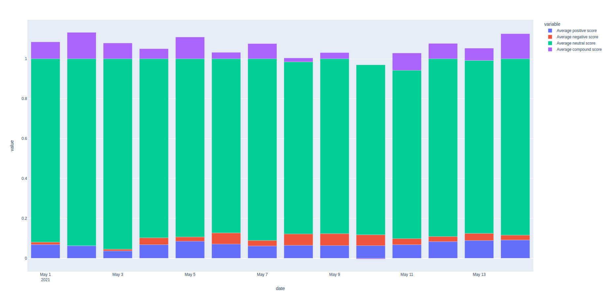
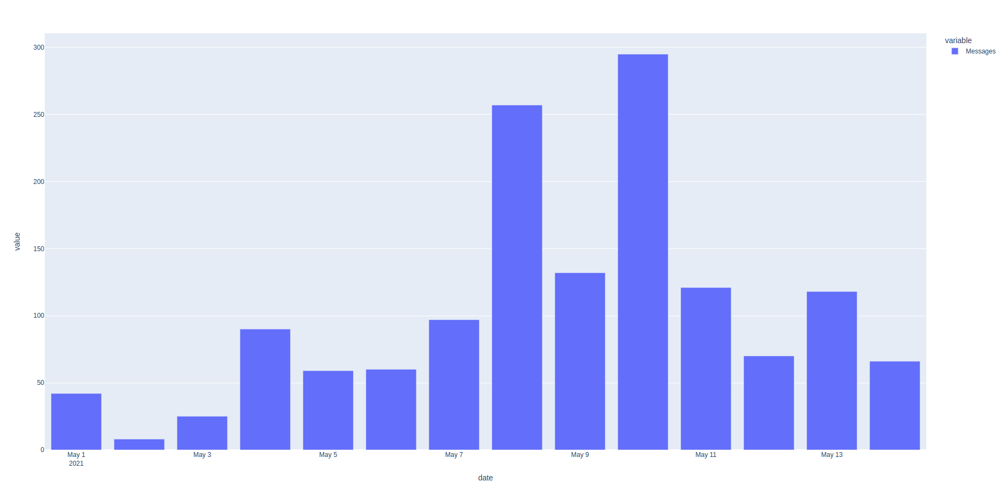

# Sentiment_Analysis_telegram

The sentiments for telegram messages (05-01-2021 to 05-15-2021) is obtained using pretrained VADER model.

## Preprocess
- Clean text, and structure the unstructured data, so the message is a simple string.
- Remove the non-English words.
- Filter the messages that contain SHIB or DOGE.

Vader model is run for the pre-procesed messages and the plot of sentiments is generated as shown below

## Instructions for run

- Python version: 3.6
- Install dependencies:  pip install -r requirements.txt
- Program run: python main.py 
