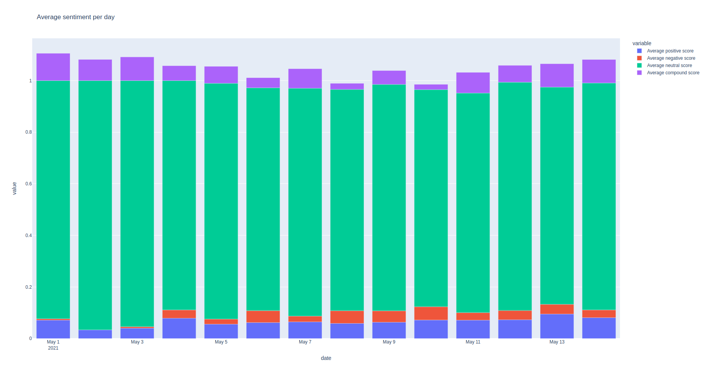

# Sentiment_Analysis_telegram

The sentiments for telegram message (05-01-2021 to 05-15-2021) is obtained using pretrained VADER model.

## Preprocess
- Clean text, and structure the unstructured data, so the message is a simple string.
- Remove the non-English words.
- Filter the messages that contain SHIB or DOGE.

Vader model is run for the pre-processed messages and the plot of sentiments is generated as shown below

## Instructions for run

- Python version: 3.6
- Install dependencies:  pip install -r requirements.txt
- Program run: python main.py 

## Summary

Most of the days in 15 days period, the telegram group is majorly neutral in nature (slightly inclined with positive sentiment), which could be justified as we see a lot of messages in nature of enquiry/informative without any opinions.

